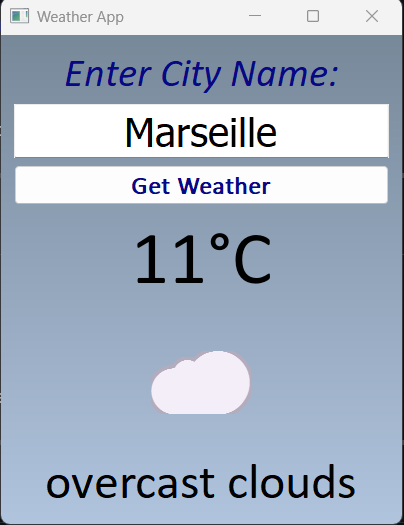
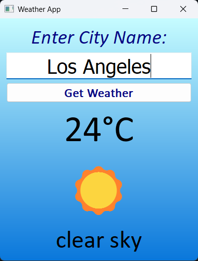

# 🌤 Weather-App
A desktop weather application built with Python and PyQt5 that retrieves real-time weather data from the OpenWeatherMap API and displays it with a clean graphical interface, weather emojis, animated transitions, and dynamic gradient backgrounds.

---

## ✨ Features

- Search weather by **city name**
- Displays **temperature in Celsius**
- Shows **weather description**
- **Dynamic gradient background** depending on weather conditions
- **Weather emojis** representing current conditions
- **Smooth fade-in animation** for results
- Press **Enter** or click the button to search
- **Error handling** for invalid cities, API issues, and connection errors

---

## 📷 Screenshot

  
  

---

## 🛠 Technologies Used

- **Python**
- **PyQt5** – GUI framework
- **Requests** – for HTTP requests
- **OpenWeatherMap API** – weather data provider

---

## 🔑 API Key Setup

This application uses the OpenWeatherMap API to retrieve weather data.

To run the project, you need your own API key.

https://openweathermap.org/api

---

Required libraries:

- PyQt5
- requests

---

## 📄 License

This project is open-source and available under the **MIT License**.

